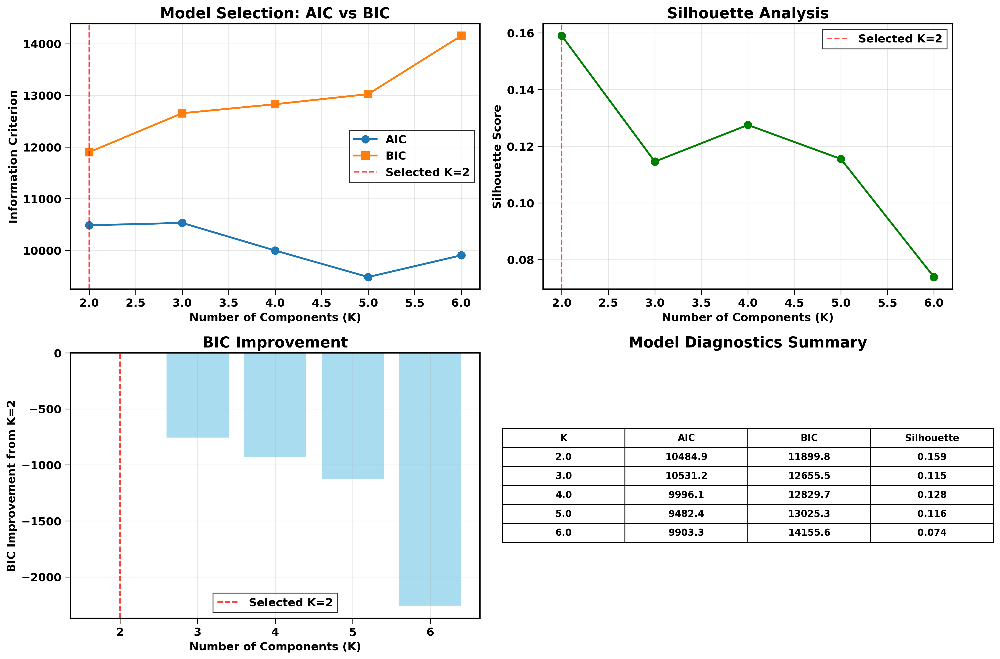
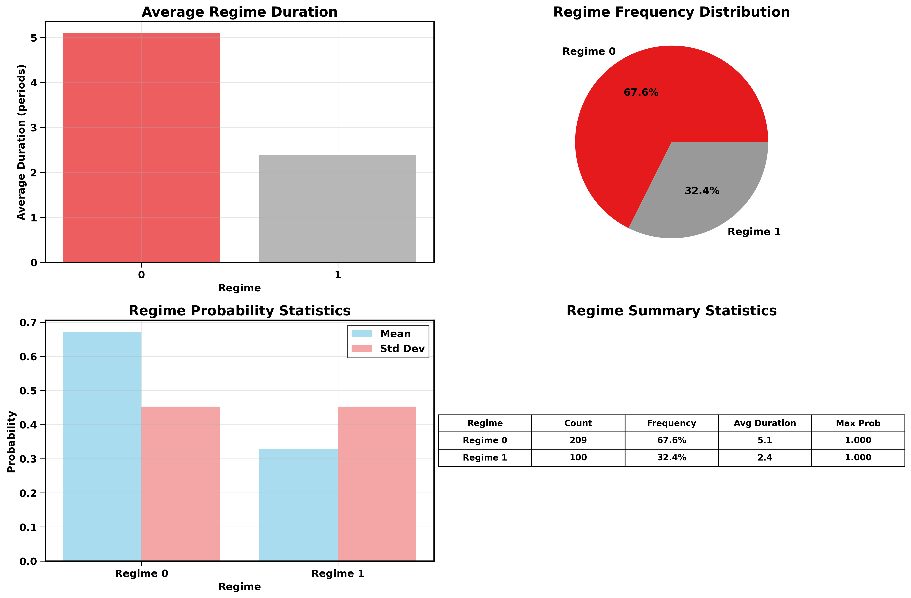

# Market Regime Detection with PCA and Gaussian Mixture Models

This project implements a data-driven approach to detecting financial market regimes by combining **Principal Component Analysis (PCA)** for dimensionality reduction with a **Gaussian Mixture Model (GMM)** for unsupervised clustering.  

The goal is to identify persistent market conditions (regimes) using historical financial and macroeconomic factors, inspired by approaches such as Two Sigma's factor lens research.

---

## Table of Contents
1. [Background](#background)
2. [Mathematical Overview](#mathematical-overview)
   - [Principal Component Analysis (PCA)](#principal-component-analysis-pca)
   - [Gaussian Mixture Models (GMM)](#gaussian-mixture-models-gmm)
3. [Repository Structure](#repository-structure)
4. [Setup and Installation](#setup-and-installation)
   - [FRED API Key](#fred-api-key)
5. [Usage](#usage)
6. [Results](#results)
7. [References](#references)

---

## Background
Financial markets often exhibit **regimes**—extended periods of relatively stable behavior (e.g., crisis, steady growth, inflationary periods).  
Detecting these regimes can help in:
- Risk management and stress testing
- Portfolio construction and tactical allocation
- Identifying market fragility

This project uses:
- **PCA** to reduce correlated factor data into orthogonal components.
- **GMM** to cluster observations into regimes, each modeled as a multivariate Gaussian distribution.

---

## Mathematical Overview

### Principal Component Analysis (PCA)
- PCA is a linear transformation that projects high-dimensional data into orthogonal components ranked by variance explained.  
- Mathematically:  
  - Given a dataset **X** with covariance matrix **Σ**, solve the eigenvalue problem:  
    
    **Σv<sub>i</sub> = λ<sub>i</sub>v<sub>i</sub>**
    
  - Principal components are eigenvectors **v<sub>i</sub>** ordered by descending eigenvalues **λ<sub>i</sub>**.  
- In this project, PCA reduces groups of factors (e.g., Equity, Credit, Commodities) into representative components.

### Gaussian Mixture Models (GMM)
- GMM assumes data is generated from a mixture of **K** Gaussian distributions:

  **p(x) = Σ<sub>k=1</sub><sup>K</sup> π<sub>k</sub> 𝒩(x | μ<sub>k</sub>, Σ<sub>k</sub>)**
  
  where **π<sub>k</sub>** are mixture weights, **μ<sub>k</sub>** are means, and **Σ<sub>k</sub>** are covariance matrices.  
- Parameters are estimated via the **Expectation-Maximization (EM)** algorithm.
- Unlike K-means, GMM allows:
  - Soft cluster assignments (probabilistic regimes)
  - Elliptical clusters via covariance structure

---

## Repository Structure
```
├── data/                     # Raw data storage folder
├── gmm_plots/               # Output plots and visualizations
├── .gitignore              # Git ignore file
├── compute_returns.py      # Computes returns from raw factor data
├── factor_lens.db          # SQLite database for factor data
├── factors.csv             # Factor metadata (categories, proxies, names, data sources)
├── gmm.py                  # Runs GMM clustering and regime detection
├── init_db.py              # Initializes the SQLite database
├── load_bloomberg.py       # Loads Bloomberg data into database
├── load_fred.py            # Loads FRED economic data into database
├── load_french.py          # Loads French factor data into database
├── pca.py                  # Performs PCA analysis on factor groups
├── README.md               # Project documentation
├── requirements.txt        # Python dependencies
├── seed_instruments.py     # Seeds instrument metadata into 
└── visualizations.py       # Produces summary visualizations
database
```

---

## Setup and Installation

### Clone the repository
```bash
git clone https://github.com/your-username/market-regime-detection.git
cd market-regime-detection
```

### Install dependencies
```bash
pip install -r requirements.txt
```

### FRED API Key Setup
1. Go to [FRED](https://fred.stlouisfed.org/) and create a free account.
2. Generate an API key under **My Account > API Keys**.
3. Export it in your shell (or add to `.bashrc`/`.zshrc`):
   ```bash
   export FRED_API_KEY="your_api_key_here"
   ```

---

## Usage

Follow these steps in order to set up and run the analysis:

### Step 1: Prepare Raw Data
- Place your raw financial data files in the `data/` folder
- Ensure data is in CSV format with appropriate date and value columns

### Step 2: Initialize Database
```bash
python init_db.py
```
This creates the SQLite database structure for storing factor data.

### Step 3: Seed Instrument Metadata
```bash
python seed_instruments.py
```
This populates the database with instrument definitions and metadata.

### Step 4: Load Factor Data
Load data from various sources into the database:
```bash
python load_bloomberg.py    # Load Bloomberg market data
python load_fred.py         # Load FRED economic indicators  
python load_french.py       # Load French factor library data
```

### Step 5: Compute Returns
```bash
python compute_returns.py
```
This calculates returns and transformations for all factors in the database.

### Step 6: Principal Component Analysis
```bash
python pca.py
```
This applies PCA to factor groups to reduce dimensionality.

### Step 7: Gaussian Mixture Model Analysis
```bash
python gmm.py
```
This fits GMM across different numbers of clusters and outputs:
- Regime probabilities and assignments
- Model selection metrics (AIC, BIC, Silhouette)

### Step 8: Generate Visualizations
```bash
python visualizations.py
```
This provides various visualizations of our regime analysis (saved to /gmm_plots), such as:
- Regime evolution over time
- Mean returns and volatility per factor over each regime
- Model selection metrics

---

## Results




---

## References
- Two Sigma (2021). *A Machine Learning Approach to Regime Modeling*  
- scikit-learn documentation: [PCA](https://scikit-learn.org/stable/modules/generated/sklearn.decomposition.PCA.html), [GaussianMixture](https://scikit-learn.org/stable/modules/generated/sklearn.mixture.GaussianMixture.html)

---